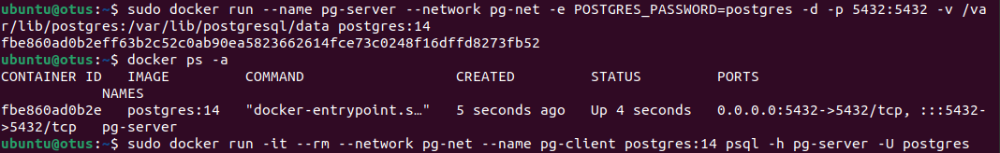
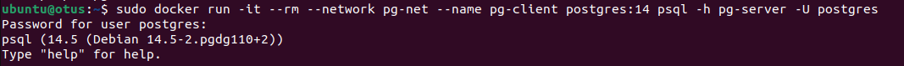
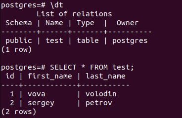
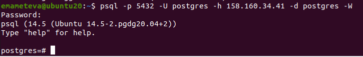
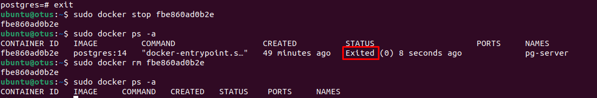
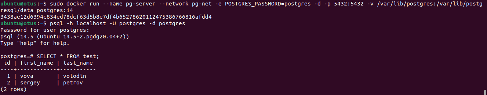

# OTUS-homework_2

* Ставим Docker на ВМ в ЯО.
* Устанавливаем контейнер с  PostgreSQL 14 прописывая путь -v /var/lib/postgres с открытым доступом к pg-server

* Запускаем контейнер с клиентом postgres

* Подключаемся и создаем для теста таблицу

   
* Подключаемся к контейнеру с VM VirtualBox (предварительно поставив на нее клиент postgres14)

* удаляем контейнер, предварительно остановив

* Создаем заново и снова подключаемся с клиента к серверу. как видим данные таблицы у нас остались, т.к. они подтягиваются с docker volumes.

